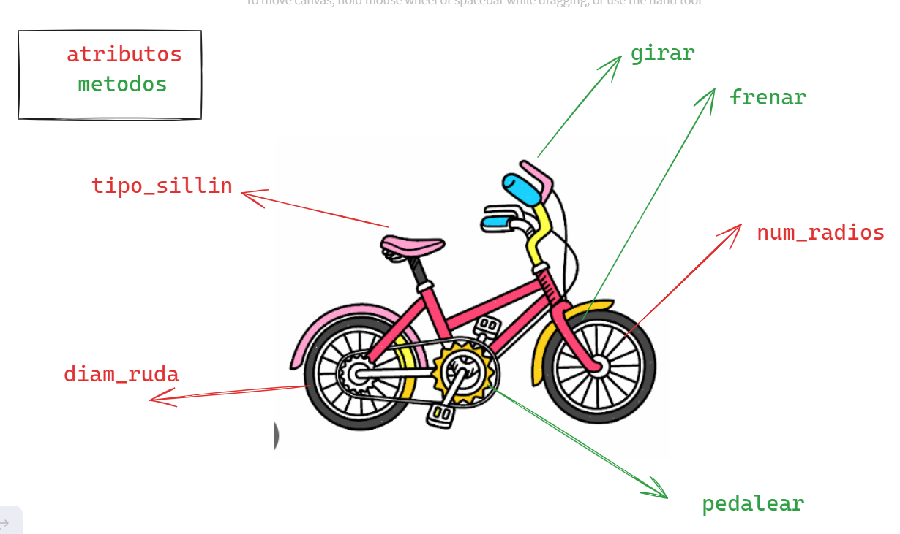

# 🚌POO - PROGRAMACION ORIENTADA A OBJETOS
La programacion orientada a objetos - `POO` o en sus siglas en ingles `OOP`, es una manera de programar (paradigma*), que permite llevar al codigo mecanismos usados con entidades de la vida real.

**sus benefisios son los siguientes:**

1. **ENCAPSULAMIENTO:** permite `empaquetar` el codigo dentro de una unidad (objeto) donde se puede determinar el ambito de actuacion.
2. **ABSTRACCION:** permite `generalizar` los tipos de objetos atravez de las clases y simplificar el programa.
3. **HERENCIA:** permite `reutilizar` codigo al poder heredar atributos y comportamientos de una clase.
4. **POLIMORFISMO:** permite `crear` multiples objetos a partir de una misma pieza flexible de codigo.

>Existen dos pilares basicos que a nivel educativo no es nesesario aprenderlo.

5. **ACOPLAMIENTO**
6. **COHESION**

## QUE ES UN OBJETO
un `objeto` es un tipo de dato estructurado que contiene o almacena `datos` y `codigo`. 

|Elementos|Que son |Como se llama|Como se identifica  |
|---------|--------|-------------|--------------------|
|Dato     |Variable|Atributos    |Mediante sustantivos|
|Codigo   |Funcion |Metodo       |Mediante verbos     |

un objeto representa un `instancia unica` de alguna `entidad` a travez de sus atributos e interactua con otros objetos o con si mismo a travez metodos.

## QUE ES UNA CLASE
Para crear un `objeto` primero debemos definir la `clase`

Para responder la pregunta de alex debemos pensar en la `clase` como el `molde` con el que se crean nuevos objetos.

Es el proceso de diseño de una clase ay que tener en cuenta `el principio de responsabilidad unica` esto intentando que los `atributos` y los`metodos` esten enfocados en un objetivo unico y bien definido.

> [!TIP]
> *Un paradigma de programacion es un metodo, tecnica o estilo de programar. muchos de los lenguajes de programacion son creados en base de un paradigma, ejemplo java es un lenguje que adopta el paradigma POO(programacion orientada a objetos) sin embargo existen lenguajes de programacion que adoptan varios paradigmas como es el caso de python y javascrip estos son lenguajes paradigmas.
